# Passagem visual dos 13 mini games

23/09/2026. Revisão restrita à apresentação 3D. Regras, pontuação, condições de conclusão, economia, navegação, HUD e versões 2D não foram redesenhados. Lawn 3D permanece intacto.

## Como comparar

Execute `npm run web:games` ou `npm run dev:games`. No Laboratório, use `Testar <jogo> · <variação> · 3D` e `Comparar <jogo> · <variação> · 2D original`. Os modos livres continuam disponíveis. Não há assets remotos ou novas dependências.

As capturas abaixo são do Chrome, 390 × 844, nesta rodada. Não representam uma medição de Expo GL em aparelho físico. Os estados durante/final estão em `visual-3d/states/`; algumas capturas finais incluem a transição do modal React Native existente. A auditoria inicial está em [AUDITORIA_VISUAL_3D.md](AUDITORIA_VISUAL_3D.md).

## Benchmark e decisões

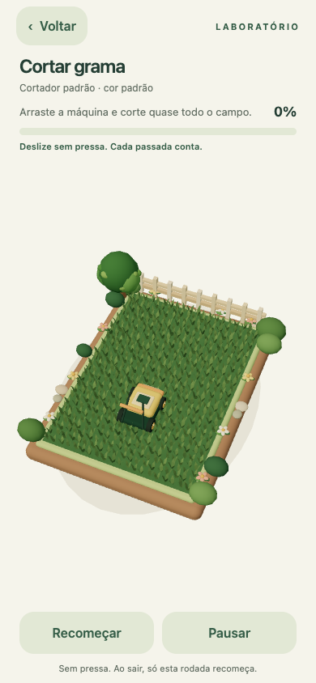

O Lawn tem silhueta de diorama, espessura na base, composição diagonal, contato com o chão, vegetação periférica variada e uma transformação claramente legível. Aplicamos esses princípios, não seus objetos, aos demais jogos. A auditoria por capturas levou a abrir as câmeras, mostrar bordas e retirar o aspecto quadriculado das superfícies. O critério comparativo é direção/composição/coerência, não quantidade de polígonos. Não é possível certificar subjetivamente “premium em todos os aparelhos” a partir do Chrome; o dispositivo da banca ainda precisa de aprovação visual.

Todos recebem key quente, fill frio discreto, rim de separação e hemisphere; luz noturna possui parâmetros próprios. Shadow map de 1024 na key, sombras de contato desenhadas e materiais foscos/esmaltados fazem a separação de planos sem pós-processamento. A infraestrutura é a mesma [R3F native + Expo GL](https://r3f.docs.pmnd.rs/getting-started/installation#react-native); antialiasing e sombras precisam de inspeção nativa, pois [GLView](https://docs.expo.dev/versions/v57.0.0/sdk/gl-view/) é um render target OpenGL ES, não o navegador.

## 1. Cortar frutas — cozinha de bancada

- **Direção/cenário:** cozinha creme, madeira, azulejos, prateleira com louças, planta, pano, faca decorativa e tábua com veios. Câmera diagonal mostra espessura e parede, mantendo os seis alvos originais.
- **Geometria/materiais:** frutas com mais segmentos, proporção variável por tipo, detalhes de casca, folhas; polpa cítrica com divisões radiais. Roughness diferenciada, clearcoat discreto, madeira fosca e louças esmaltadas.
- **Animação/partículas/conclusão:** metades deslizam e inclinam; impulso de escala e gotas de suco. A conclusão conserva as frutas cortadas e acrescenta gotas, sem medalhão genérico.
- **Comparação Lawn:** a bancada agora tem primeiro plano, superfície principal e fundo, além de ferramenta/objetos identificáveis. O contraste está na fruta, não na decoração.
- **Arquivos:** `fruit/FruitGame3D.tsx` modificado; `fruit/KitchenEnvironment.tsx` criado.

| Antes | Depois |
|---|---|
| 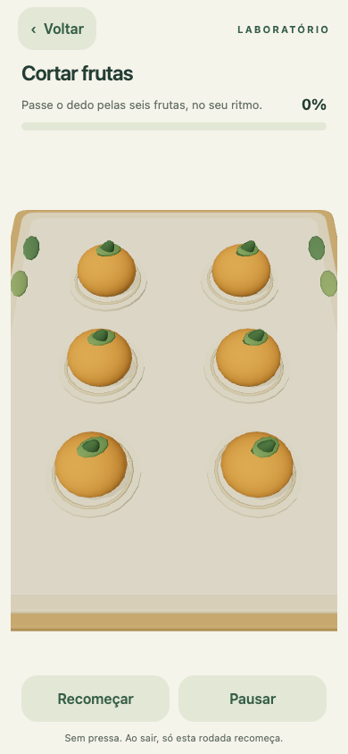 | 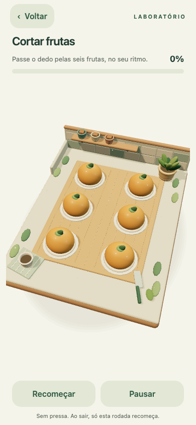 |

## 2. Pequenas luzes — pátio de lanternas

- **Direção/cenário:** pátio azul-petróleo, vasos, caminho de pedras e cordão de lâmpadas suspensas. A cena noturna permanece acolhedora e legível.
- **Geometria/materiais:** lanternas têm base arredondada, quatro montantes, cobertura e alça; globo emissivo, armação menos brilhante e piso escuro.
- **Iluminação/animação/partículas:** luz fria de ambiente, rim âmbar, ponto quente em cada lanterna acesa; pequenos pontos suspensos e pulso ao acender. Corrigido o pulso que adicionava escala a cada frame.
- **Conclusão/comparação Lawn:** o próprio ambiente ilumina-se; não usa o mesmo confete dos jardins. Há mudança visual acumulativa tão clara quanto o gramado aparado, com linguagem noturna própria.
- **Arquivos:** `lights/LightsGame3D.tsx` modificado; `lights/LanternEnvironment.tsx` criado.

| Antes | Depois |
|---|---|
| 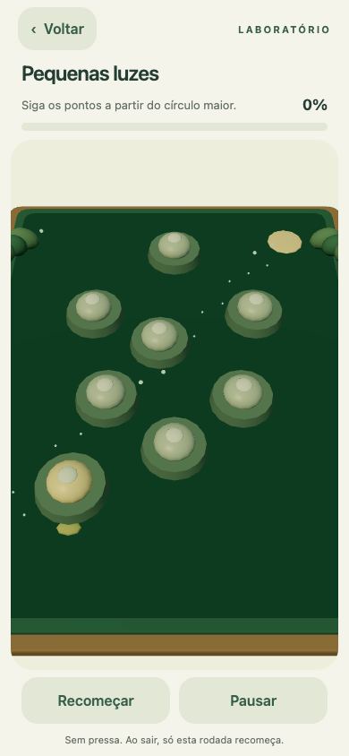 | 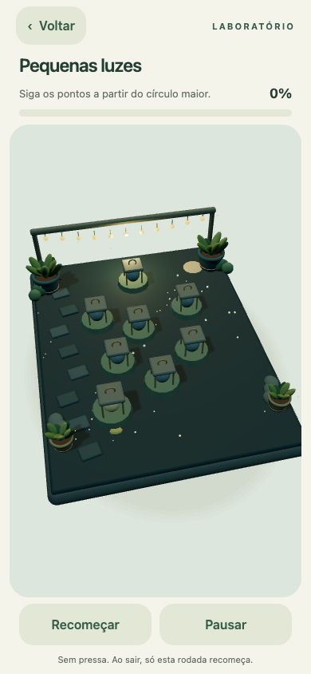 |

## 3. Organizar pedrinhas — mesa de coleção natural

- **Direção/cenário:** mesa verde-sálvia com superfície tátil, caderno, lápis, livros, vaso e pedras empilhadas. Câmera inclinada para o lado oposto à cozinha.
- **Geometria/materiais:** encaixes passam a repetir a silhueta de cada pedra; a peça retangular tem bevel contínuo, sem emenda entre primitivas. Madeira, papel e pedra têm acabamentos distintos.
- **Animação/partículas/conclusão:** levantamento e inclinação durante drag preservados; compressão e retorno elástico ao encaixar; reação sincronizada no final. Poeira ambiente discreta, sem confete de conclusão.
- **Comparação Lawn:** bordas e objetos secundários constroem um lugar reconhecível. A área central continua livre por necessidade da organização, não por ausência de ambientação.
- **Arquivos:** `arrange/ArrangeGame3D.tsx` modificado; `arrange/DeskEnvironment.tsx` criado e parametrizado para os dois jogos de organização.

| Antes | Depois |
|---|---|
| 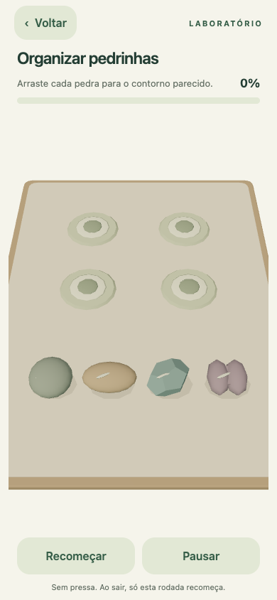 | 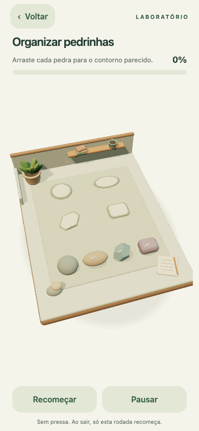 |

## 4. Bolinhas por cor — mesa de brinquedos

- **Direção/cenário:** madeira clara, tapete com costura, brinquedos arredondados na prateleira, anéis empilhados e planta.
- **Geometria/materiais:** esferas suaves com acabamento acetinado/clearcoat; símbolos reposicionados acima da superfície para não ficarem escondidos. A acomodação final reduz e separa visualmente as duas bolas de cada cesto, sem mudar o destino lógico.
- **Iluminação/animação/conclusão:** luz quente lateral, contato e highlights; squash de encaixe e bounce final sincronizado. Partículas suspensas apenas no ambiente.
- **Comparação Lawn:** leitura tátil, objetos com volumes distintos e sinais claros de interação; mantém a clareza dos símbolos, além da cor.
- **Arquivos:** `arrange/ArrangeGame3D.tsx`, `arrange/DeskEnvironment.tsx`.

| Antes | Depois |
|---|---|
| 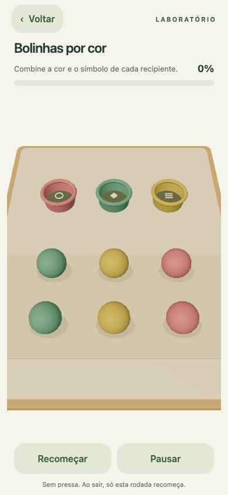 | 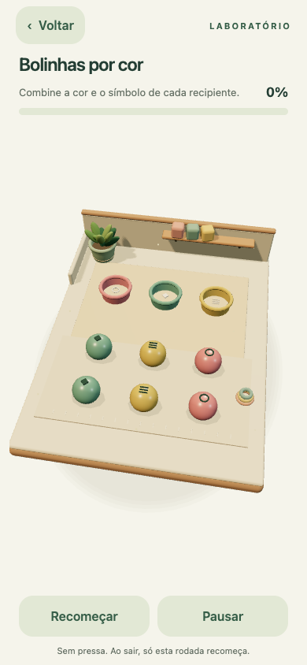 |

## 5. Jardim de areia — caixa zen

- **Direção/cenário:** bordas de madeira com friso, pedras equilibradas e círculos de areia, bambus segmentados, planta e vela.
- **Geometria/materiais:** ancinho com cabeça arredondada, areia fosca, pedras suaves e madeira com tons separados. Luz rasante valoriza trilhas claras/escuras.
- **Animação/partículas/conclusão:** bambu balança lentamente; grãos acompanham o ancinho; conclusão aproxima discretamente a câmera e aquece a vela. Os quatro percursos e o modo livre não mudam.
- **Comparação Lawn:** a transformação é o desenho na areia. Decoração ocupa cantos, conservando espaço real para desenhar; o vazio central é deliberado.
- **Arquivos:** `sand/SandGame3D.tsx` modificado; `sand/ZenEnvironment.tsx` criado.

| Antes | Depois |
|---|---|
| 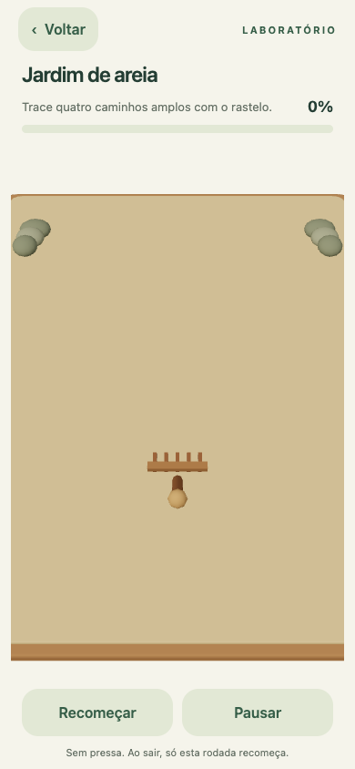 | 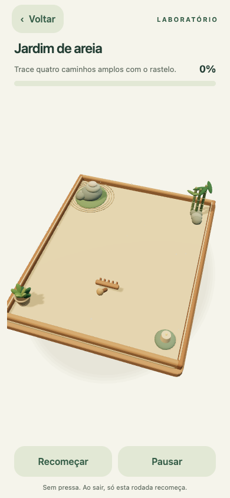 |

## 6. Tapete de flores — viveiro de quatro canteiros

- **Direção/cenário:** canteiros com pedras, caminho central, cerca baixa, folhagem e flores periféricas.
- **Geometria/materiais:** seis pétalas instanciadas por flor substituem discos; alturas variadas, centros, folhas e caules. Paletas de rosa, margarida e lavanda preservadas.
- **Iluminação/animação/partículas:** key quente, rim sobre pétalas, crescimento suave e vento pequeno. Conclusão em pétalas, mantendo o jardim plantado.
- **Comparação Lawn:** riqueza periférica e transformação gradual da área principal; variação de escala e vegetação fazem o vínculo mais direto com o benchmark sem copiar o gramado.
- **Arquivos:** `flowers/FlowersGame3D.tsx` modificado; `flowers/NurseryEnvironment.tsx` criado.

| Antes | Depois |
|---|---|
| 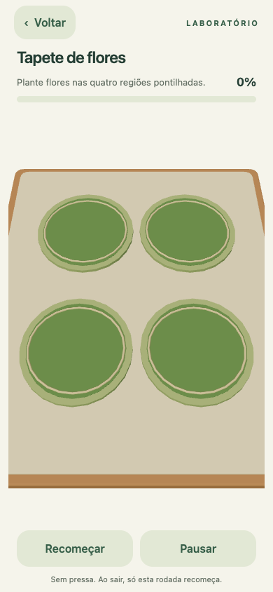 | 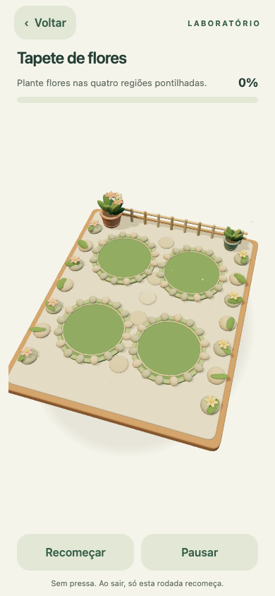 |

## 7. Tinta na água — atelier de marmorização

- **Direção/cenário:** cuba esmaltada com bordas volumétricas, pigmentos, prateleira, planta e instrumento de mistura.
- **Geometria/materiais:** água em tons aquosos, highlights simulados, quatro filamentos ondulados por mancha e sobreposição translúcida. A geometria dos filamentos é reutilizada; não há simulação física de fluidos.
- **Animação/partículas/conclusão:** expansão original preservada, filamentos giram lentamente e reflexos oscilam; gotas discretas na conclusão.
- **Comparação Lawn:** a cuba tem espessura e contexto, e a transformação agora tem detalhe interno em vez de círculos uniformes. O espaço vazio inicial faz parte da mecânica de criar manchas.
- **Arquivos:** `ink/InkGame3D.tsx` modificado; `ink/MarblingEnvironment.tsx` criado.

| Antes | Depois |
|---|---|
| 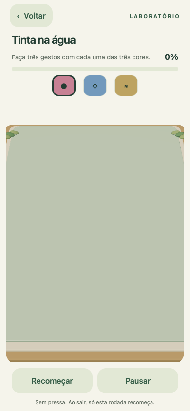 | 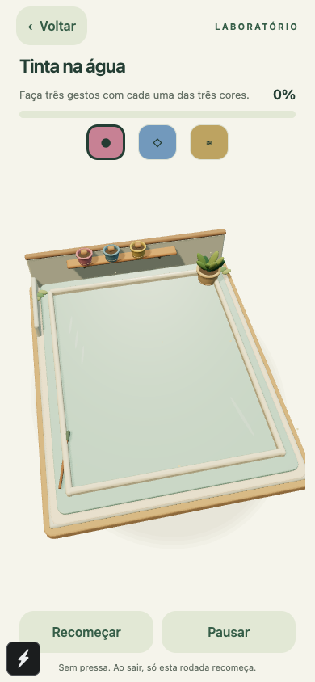 |

## 8. Regar um jardim — estufa de vasos

- **Direção/cenário:** piso de ripas, estrutura de estufa, prateleira com vasos e flores, plantas em primeiro plano.
- **Geometria/materiais:** vasos torneados com borda e friso, terracota fosca e regador verde. O modelo do regador foi deslocado para aproximar seu bico do ponto lógico de rega.
- **Iluminação/animação/partículas/conclusão:** luz de manhã; crescimento original das plantas, gotas animadas na rega e celebração aquosa ao florescerem.
- **Comparação Lawn:** ambiente de jardinagem com profundidade e crescimento visível, sem reutilizar o terreno, árvores ou cortador.
- **Arquivos:** `water/WaterGame3D.tsx` modificado; `water/GreenhouseEnvironment.tsx` criado.

| Antes | Depois |
|---|---|
| 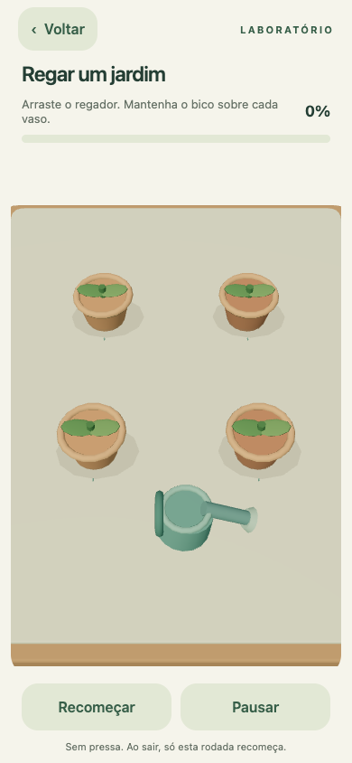 | 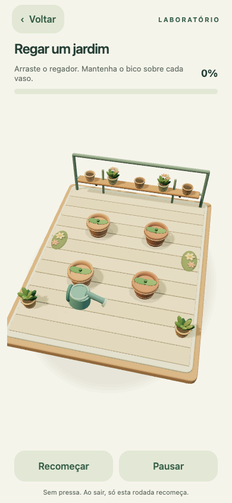 |

## 9. Janela embaçada — janela-diorama

- **Direção/cenário:** moldura espessa, peitoril, cortinas com pregas e amarrações, vasos floridos; paisagem com nuvens, água, colinas e flores em planos.
- **Geometria/materiais:** pano arredondado; vidro embaçado contínuo, removendo a grade aparente. As colinas foram contidas no enquadramento para não atravessarem as laterais.
- **Iluminação/animação/partículas/conclusão:** luz confortável, poeira suspensa e pequenas gotas ao limpar; reflexos cruzados ao terminar, sem confete.
- **Comparação Lawn:** moldura e peitoril assumem a função de foreground, com paisagem ao fundo e vidro como plano interativo.
- **Arquivos:** `surface/SurfaceGame3D.tsx`, `SurfaceEnvironment.tsx`, `SurfaceTiles.tsx`, `SurfaceTool.tsx` modificados; `surface/three/WindowSurround.tsx` criado.

| Antes | Depois |
|---|---|
| 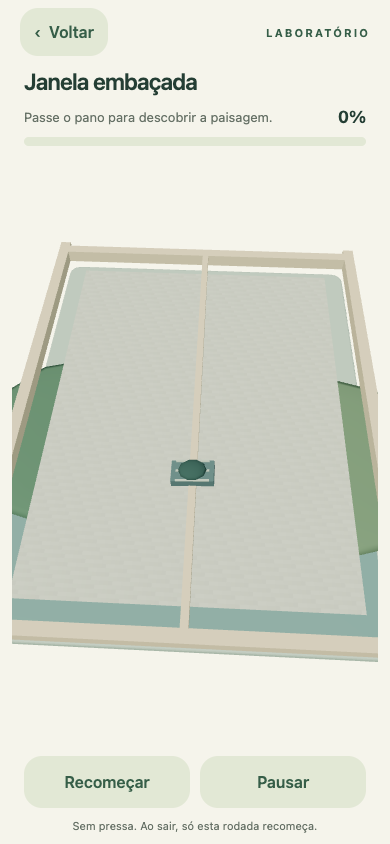 | 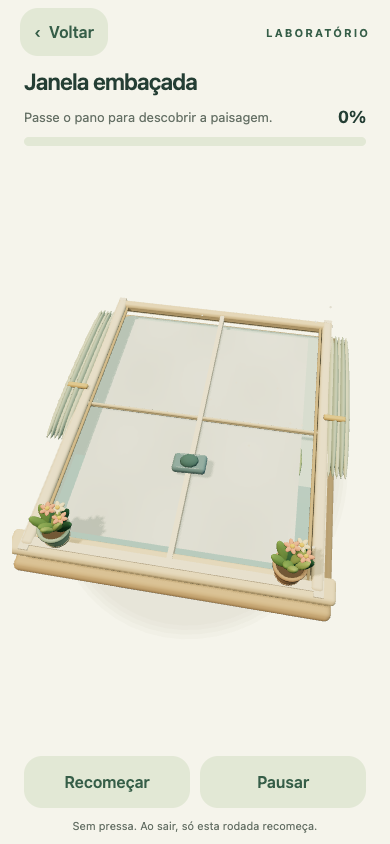 |

## 10. Revelar ilustração — teatro de papel

- **Direção/cenário:** mesa com moldura trabalhada, lápis, pigmentos e flores. As três ilustrações têm volumes próprios: casa, barco e borboleta.
- **Geometria/materiais:** casa com porta/janelas/telhado, árvores com folhas, flores e caminho; barco com casco/velas; borboleta com asas sobrepostas e marcas. Papel e madeira permanecem foscos.
- **Iluminação/animação/partículas/conclusão:** camada de revelação contínua, poeira junto ao pincel; no final, o baixo-relevo ganha altura e a câmera aproxima suavemente.
- **Comparação Lawn:** o prêmio é a transformação da própria cena em um pequeno diorama, não um objeto genérico sobreposto.
- **Arquivos:** camada `surface` modificada; `IllustrationDesk.tsx` e `RevealedRelief.tsx` criados.

| Antes | Depois |
|---|---|
| 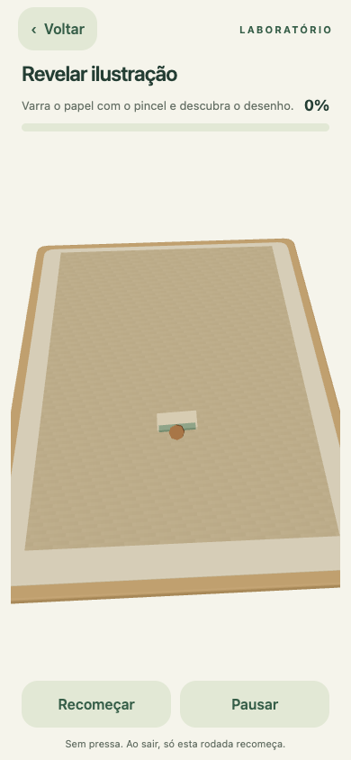 | 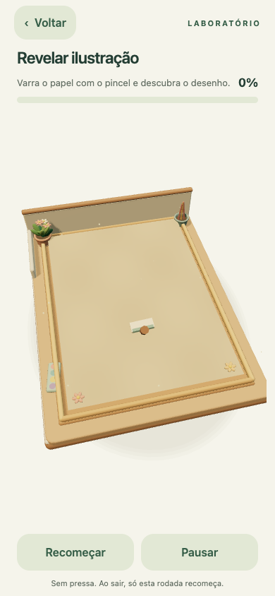 |

## 11. Lavar objetos — bancada de cerâmica

- **Direção/cenário:** cuba clara, azulejos, torneira curva, pano dobrado, sabão, louça auxiliar e planta.
- **Geometria/materiais:** vaso com maior profundidade e esmalte brilhante; sujeira contínua acompanha o relevo. Contraste matte/sujo contra cerâmica limpa.
- **Iluminação/animação/partículas/conclusão:** key/rim definem volume, espuma com bolhas em pool segue o jato; pequenos reflexos no fim. Somente células do vaso contam, como antes.
- **Comparação Lawn:** transformação material imediatamente legível e cenário contextual; aproxima a satisfação do corte por outro tipo de antes/depois.
- **Arquivos:** camada `surface` modificada; `WashStudio.tsx` criado.

| Antes | Depois |
|---|---|
| 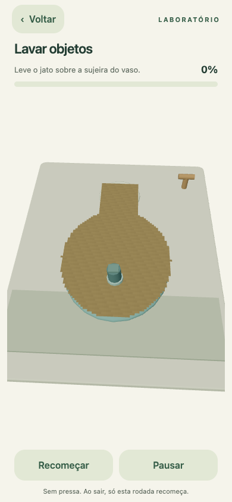 | 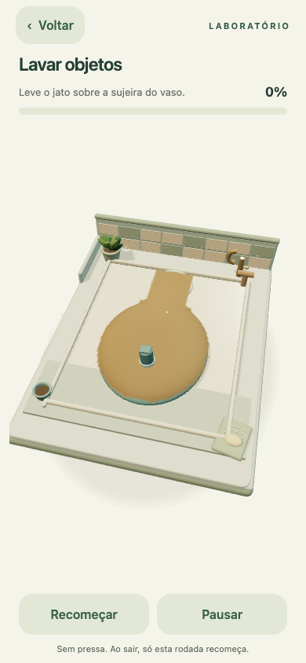 |

## 12. Alisar argila — atelier de cerâmica

- **Direção/cenário:** bancada, bandeja, cerâmicas na prateleira, rolo, fragmentos de argila e planta.
- **Geometria/materiais:** relevo ondulado contínuo em vez de tiles aleatórios; espátula arredondada; camada final lisa. Terracota matte, madeira e vaso esmaltado separam os materiais.
- **Iluminação/animação/partículas/conclusão:** luz revela ondulações, pequenas partículas acompanham a espátula; iluminação rasante final valoriza a superfície alisada, sem anel dourado.
- **Comparação Lawn:** o relevo inicial e o acabamento final dão leitura material ao gesto; objetos periféricos tornam o local reconhecível.
- **Arquivos:** camada `surface` modificada; `ClayStudio.tsx` criado.

| Antes | Depois |
|---|---|
| 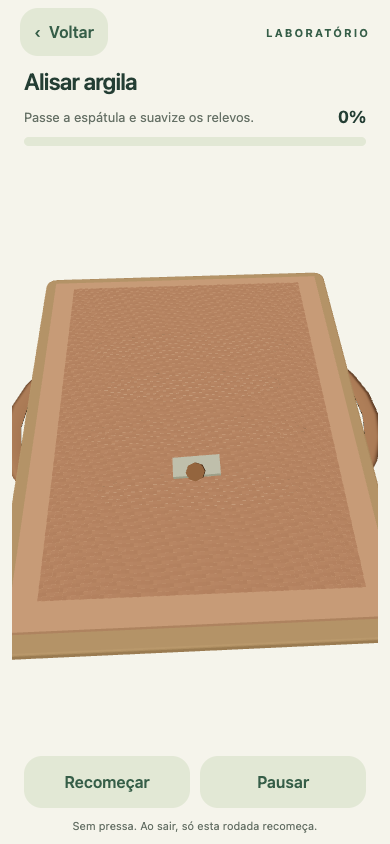 | 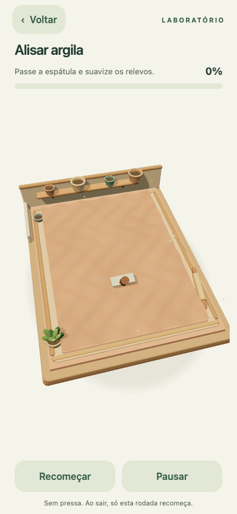 |

## 13. Pintar com rolinho — atelier de pintura

- **Direção/cenário:** moldura de madeira, potes de pigmento e pincéis, paleta, bandeja de rolo e planta.
- **Geometria/materiais:** bordas arredondadas e volumes de tinta, cobertura contínua com roughness menor que a tela seca; paleta original do HUD preservada.
- **Iluminação/animação/partículas/conclusão:** reflexos sutis valorizam a cor, respingos acompanham o rolo; pequeno dolly final destaca a área pintada. Não se introduziu desenho obrigatório nem mudança de regra.
- **Comparação Lawn:** transformação da superfície, objetos contextuais e camadas de composição; o plano central segue grande porque é a própria área de pintar.
- **Arquivos:** camada `surface` modificada; `PaintAtelier.tsx` criado.

| Antes | Depois |
|---|---|
| 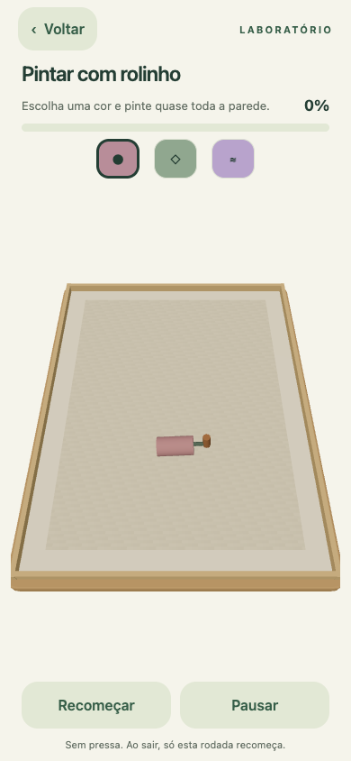 | 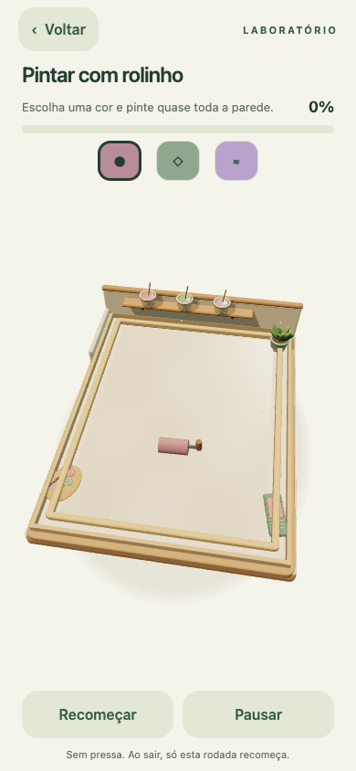 |

## Componentes e cuidados técnicos

- `three/Diorama.tsx`: SoftBox com bevel, Pebble, Vessel torneado, Plant, Blossom, StudioLight, RoomShell, Shelf, Motes, Arrival, CompletionDolly e FinishDust. São ferramentas de renderização, sem regras ou estado de sessão.
- `three/ToolParticles.tsx`: pool de 36 partículas para poeira, gotas e bolhas. Usado por areia, rega e superfícies.
- `three/SceneFrame.tsx`: antialiasing solicitado ao renderer, sombras habilitadas e contato sob os dioramas. Gestos, projeção, pausa e navegação mantidos.
- `three/RoundedBoard.tsx`: recebe/projeta sombras. Lawn não depende destes componentes.
- `surface/three/SurfaceTiles.tsx`: conserva a interface e a cobertura original, mas desenha uma pele contínua com duas DataTextures locais (cor e máscara), relevo e fade. Libera geometria/texturas no cleanup.
- `surface/three/visualCompletion.ts`: após o motor declarar conclusão aos 95%, os resíduos são finalizados somente na renderização (fade na limpeza; última cor nas lacunas de pintura). Não modifica `cells`, `count`, `total` ou recompensas; teste específico garante essa separação.
- Geometrias proceduralmente geradas; pétalas e filamentos instanciados; sem GLB, texturas remotas, dependências novas ou pós-processamento. As escolhas não buscam 60 FPS em Android intermediário.
- Redução de movimento aplicada a vento, partículas de ferramenta, intros e câmera. Frameloop pausado continua sob controle existente.
- Scripts de captura e testes tiveram suas projeções atualizadas para as novas câmeras; módulos de regras não foram editados.

## Validação e limites

Resultados da revisão:

| Verificação | Resultado |
|---|---|
| TypeScript + testes (`npm run check`) | Aprovado, 59/59 testes |
| 13 cenas no Chrome | Abertura e capturas aprovadas, sem erros de página |
| Gestos e conclusão 3D | Todos os 13 jogos a 100%; três modos livres aprovados |
| Versões 2D e navegação (`npm run test:preview`) | 14 conclusões, pausa, reinício, dimensões, persistência e ciclo de vida aprovados |
| Economia e loja (`npm run test:economy`) | Recompensas, retry, compras, equipamento, oito itens/efeitos, cinco decorações e recarga aprovados |
| Export Android final | Gerado em `dist/android`, bundle Hermes 5,89 MB |
| Export iOS final | Gerado em `dist/ios`, bundle Hermes 5,88 MB |
| Dependências Expo | `expo install --check` aprovado com mapa local/offline; não equivale a consulta online completa |
| Aparelhos nativos | Não testados; `simctl` indisponível neste ambiente |

O script de economia precisou atualizar as coordenadas das câmeras de janela, areia, lavagem, pintura, flores e pedras; as regras/economia não mudaram. Não confundir bundle gerado com teste visual nativo.

As capturas `*-final.png` mantêm a interface normal, inclusive o modal quando ele já apareceu. Capturas adicionais `*-scene.png`, quando presentes, ocultam **somente durante a captura** o modal de conclusão para inspeção da cena já estabilizada; não representam mudança no fluxo ou HUD do aplicativo.

### Inspeção de conclusão sem o modal

| Bolinhas acomodadas | Vasos florescidos |
|---|---|
| 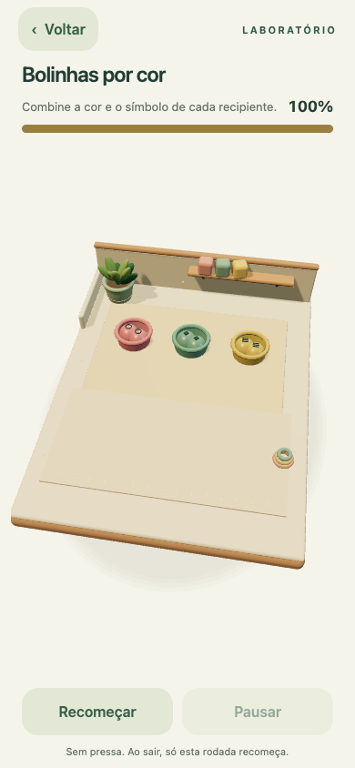 | 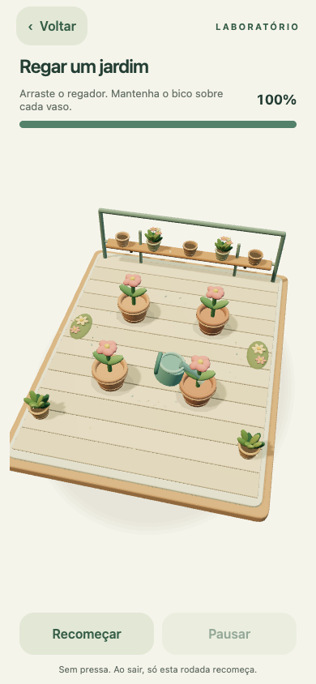 |

| Vaso limpo, sem resíduos visuais | Pintura finalizada |
|---|---|
| 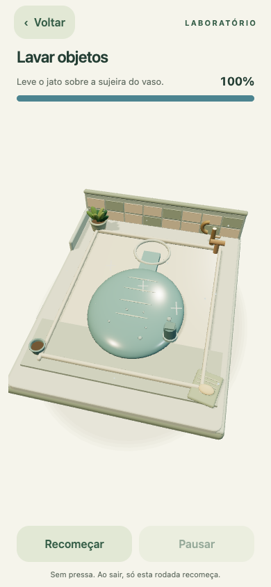 | 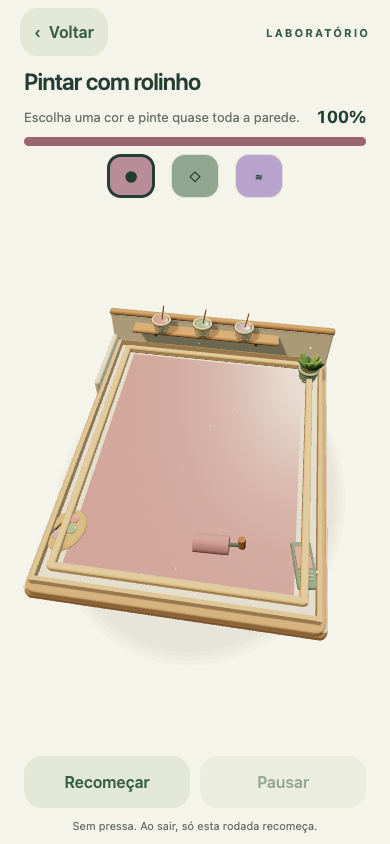 |

Ainda precisam de aparelho da apresentação: renderização de sombras/alpha/antialiasing no Expo GL, FPS sustentado, temperatura, memória após repetidas entradas/saídas, precisão do toque sobre volumes e conforto das animações. Nenhum áudio/haptic novo foi introduzido nesta revisão exclusivamente visual. A aprovação estética final deve ser feita nesse aparelho, especialmente tinta/água e superfícies translúcidas.
